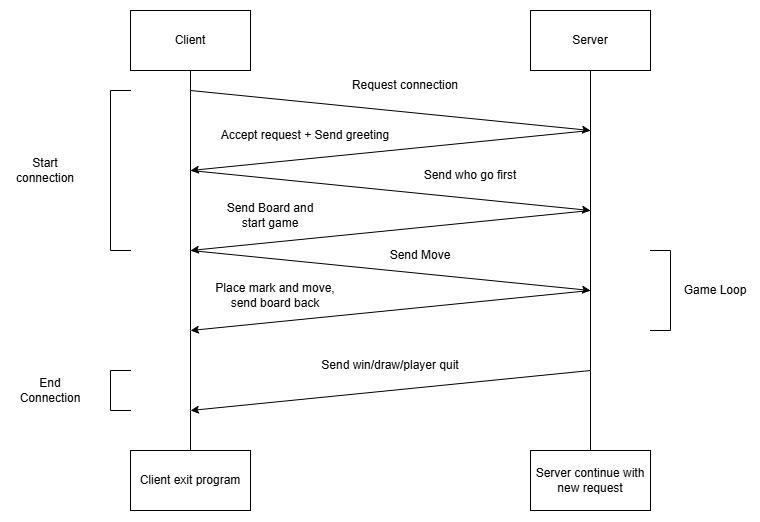
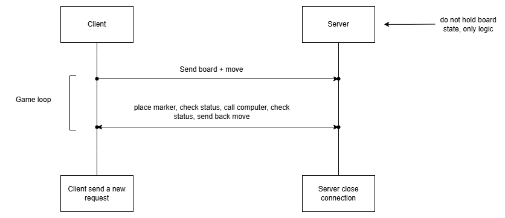

# TIC-TAC-TOE GAME

A project to learn how to be better in programming.

## Prerequisites

- Java 21 or higher
- Maven 3.6+

## How to Build

```bash
cd tttnew
mvn clean install
```

This will compile the code, run tests, and create a JAR file in the `target/` directory.

## How to Run the Game

### Basic Usage

```bash
java -jar target/tttnew-1.0-SNAPSHOT.jar <PLAYER> <BOARD_TYPE>
```

### Parameters

- **PLAYER**: Who plays first
  - `1` = Human player goes first
  - `2` = Computer player goes first
  
- **BOARD_TYPE**: Choose the board layout
  - `1d` = 1D board (linear representation)
  - `2d` = 2D board (traditional grid display)

### Examples

**Human goes first on a 2D board:**

```bash
java -jar target/tttnew-1.0-SNAPSHOT.jar 1 2d
```

**Computer goes first on a 2D board:**

```bash
java -jar target/tttnew-1.0-SNAPSHOT.jar 2 2d
```

**Human goes first on a 1D board:**

```bash
java -jar target/tttnew-1.0-SNAPSHOT.jar 1 1d
```

## Sever - Client

Note: before start the client, check if the port is the same as the sever you want to connect. The options for port are

|Port number|Server              |
|-----------|--------------------|
|9000       |Signle client Server|
|9010       |Multithread Server  |
|9020       |Threadpool Server   |
|9030       |Stateless Server    |
|9040       |Http Server         |

### How to run client server (single client-server)

```bash
# Terminal 1 server
mvn compile
java -cp target/classes tictactoe_new.SingleClientServer

# Terminal 2 client
java -cp target/classes tictactoe_new.Client
```

### How to run client server (multi thread client-sever)

```bash
# Terminal 1 server
mvn compile
java -cp target/classes tictactoe_new.multithreadingServer

# Terminal 2 client
java -cp target/classes tictactoe_new.Client
```

#### Test crashing if deploy 10K user

```bash
chmod +x testCrash.sh
./testCrash.sh
```

#### Incase you have window (like me) and somehow the damn OS ain't letting run the bash file

I have git bash to run, if you don't have it then either find a way to run it. Now run like this

```bash
bash
# Navigate to the folder have the bash file. Then run this cmd
./testCrash.sh

```

#### For those don't have nc aka netcat (still me lol)

Install netcat. Via this or find one yourself ;D

```bash
winget install Insecure.Nmap
# Check version
ncat --version
```

### How to run threadpool server

```bash
# Terminal 1 server
mvn compile
java -cp target/classes tictactoe_new.ServerThreadPool

# Terminal 2 client
java -cp target/classes tictactoe_new.Client
```

### How to run client server (Stateless)

```bash
# Terminal 1 server
mvn compile
java -cp target/classes tictactoe_new.StatelessServer

# Terminal 2 client
java -cp target/classes tictactoe_new.StatelessClient
```

### How to run client server (HTTP)

```bash
# Terminal 1 server
mvn package
java -cp target/week12-1.0-SNAPSHOT.jar tictactoe_new.httpTttServer

# Terminal 2 client
java -cp target/week12-1.0-SNAPSHOT.jar tictactoe_new.httpTttClient

# Test using curl
curl.exe -X POST http://localhost:9040/move --data-binary "000000000`n5"
```

#### This is me give up and build a ps1 file

Run via this cmd

```bash
./testCrash.ps1
```

### Note

```bash
mvn compile
java -cp target/classes week9.StatelessServer

java -cp target/classes week9.StatelessClient

mvn package
java -cp target/week12-1.0-SNAPSHOT.jar week12.httpTttServer

# Terminal 2 client
java -cp target/week12-1.0-SNAPSHOT.jar week12.httpTttClient
```

## How to Play

- Enter your move as a position number (1-9 for 2D board, or as specified in the game)
- Try to get three in a row (horizontally, vertically, or diagonally)
- The game will alternate between your moves and the computer's moves
- The game ends when someone wins or the board is full (tie)

## Running Tests

```bash
mvn test
```

This will run all unit tests in the `src/test/` directory.

## Client Server Protocol



## Stateless Client Sever


